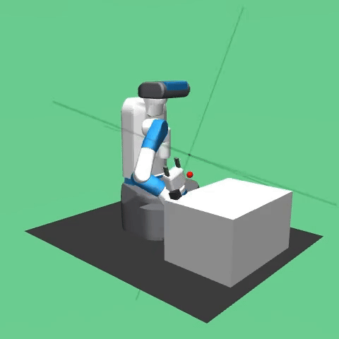

# HER
I've tried to replicate results from this openai paper:\
https://arxiv.org/pdf/1707.01495 \
However, I haven't managed to successfully train the model. So just some short visualization from bad run:\
